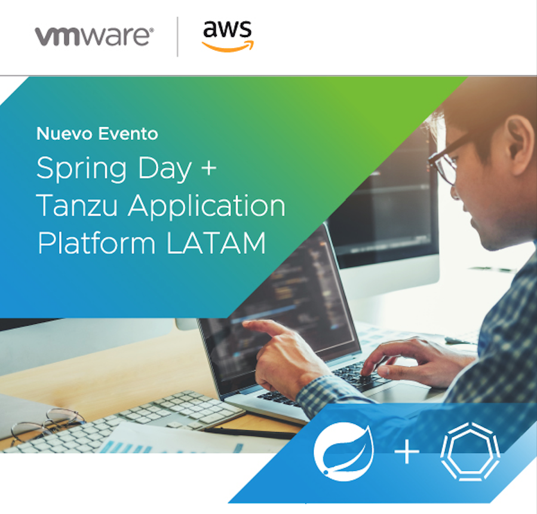
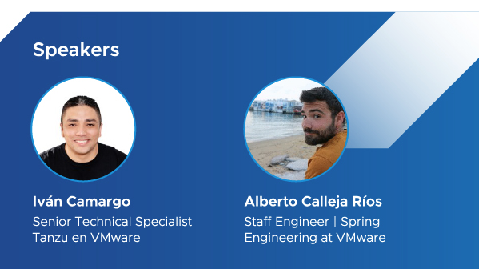

# LATAM Tour Spring Day + Tanzu Application Platform TAP 2022

  

Este es un repositorio creado para facilitar los talleres de spring en Kubernetes y Tanzu
Application Platform.

## SOLA Tour Spring Day, Kubernetes y TAP

Pre requisitos:

- Conocimientos básicos en tecnologías de Spring
- Conocimientos básicos en Kubernetes
- Laptop con un acceso a internet (2MB), navegador Google Chrome o Mozilla en sus últimas
  versiones

Resumen:

Este espacio fue creado para tener una experiencia real en las últimas tecnologías para el
desarrollador. Vamos a estar compartiendo algunas novedades de Spring. Spring hace que
programar Java sea más rápido, fácil y seguro para todos. El enfoque de Spring en la
velocidad, la simplicidad y la productividad lo ha convertido en el marco Java más popular
del mundo: https://spring.io

También vamos a estar introduciendo de manera práctica la plataforma de aplicaciones de
Tanzu. TAP VMware Tanzu Application Platform es una plataforma modular que proporciona un
amplio conjunto de herramientas para desarrolladores y un camino preparado para la
producción, para crear e implementar software de forma rápida y segura en cualquier
clúster de Kubernetes local o en cualquier nube pública
compatible: https://tanzu.vmware.com/application-platform

### Agenda

10:00-10:15 Introducción al evento:

Marco Mendoza VMware Tanzu AE, Ruben Dillon VMware Tanzu SE.

Presentadores:

Alberto Calleja Ríos - Staff Engineer - Spring Engineering at VMware Tanzu

Iván Camargo - Sr Technical Specialist at VMware Tanzu

Icebreaker - Menti

### Spring Track

10:15-10:45

[Spring antes, ahora y después](https://docs.google.com/presentation/d/1AgIchZnDVnJxG5ldWeroGMItnZeWbjK56dFksq5fOq4/edit?usp=sharing)

Q&A

10:45-12:00 Workshop Spring en Kubernetes

[Spring on Kubernetes Workshop](https://tanzu.vmware.com/developer/workshops/)

Durante este taller, aprenderá los detalles especificos de cómo crear, compilar, ejecutar
y depurar una aplicación Spring Boot básica en Kubernetes haciendo lo siguiente:

Crear una aplicación Spring Boot básica
Cree una imagen de Docker para la aplicación
Empuje la imagen a un registro de Docker
Implemente y ejecute la aplicación en Kubernetes
Pruebe la aplicación mediante el reenvío de puertos y la entrada
Use skaffold para iterar fácilmente mientras trabaja en su aplicación
Use kustomize para administrar configuraciones en todos los entornos
Externalizar la configuración de la aplicación usando ConfigMaps
Use el descubrimiento de servicios para la comunicación de aplicación a aplicación
Implemente la aplicación Spring PetClinic con MySQL.

12:00-13:00 Almuerzo

### Tanzu Application Platform Track

Durante este taller, aprenderá los detalles especificos de cómo construir, implementar,
actualizar y mantener aplicaciones en cualquier plataforma de Kubernetes de una manera
sencilla, mejorando la experiencia del desarrollador.

https://vmware-se.s3.amazonaws.com/Instructions.pdf

[Tanzu Application Platform](https://docs.google.com/presentation/d/1pxusCnTJxgHt47yle9rbuCoIBUcpqmhR/edit?usp=sharing&ouid=112891771648131852053&rtpof=true&sd=true)

13:00-13:30 Introducción a Tanzu Application Platform

13:30-14:30 Taller práctico interactivo:

La experiencia del desarrollador (acelerador de aplicaciones, herramientas IDE,
desarrollo, vista en vivo, envío a compilación)

14:30-14:45 Break

14:45- 15:45 Taller práctico interactivo:

La experiencia del operador (cargas de trabajo, Supply Chain, entregables)

15:45 – 16:00 PM : Cierre y premios

### Material de apoyo:

Qué es Kubernetes con un foco en Java: https://github.com/Albertoimpl/k8s-for-the-busy

Patrones con Spring Cloud Gateway: https://www.youtube.com/watch?v=mTY9EP-PgJM

Spring Cloud Gateway on
Kubernetes: https://spring.io/blog/2021/05/04/spring-cloud-gateway-for-kubernetes

Hola mundo con Java y Spring boot: https://github.com/Albertoimpl/hello-java-kubernetes

Vulnerabilidades en
Dockerhub: https://www.infoq.com/news/2020/12/dockerhub-image-vulnerabilities/

Dockerhub: https://hub.docker.com/

Harbor: https://goharbor.io/

Cloud code plugin: https://plugins.jetbrains.com/plugin/8079-cloud-code

Dockerfile: https://github.com/albertoimpl/hello-java-kubernetes/blob/main/Dockerfile

Dockerfile
compejo: https://github.com/docker-library/python/blob/master/3.10/alpine3.16/Dockerfile

Buildpacks: https://buildpacks.io/features/#comparison

Kubernetes in Docker: https://kind.sigs.k8s.io/

Octant: https://github.com/vmware-tanzu/octant

Skaffold: https://skaffold.dev/

Kustomize: https://kustomize.io/

Kubernetes local development workflow distilled: https://youtu.be/xG89qVn4Gx4?t=1

Arquitectura de Tanzu Application
Platform: https://github.com/vmware-tanzu-labs/tanzu-validated-solutions/blob/main/src/reference-designs/tap-architecture-planning.md

Internal:

TAP Overview: https://portal.end2end.link/

  

 
